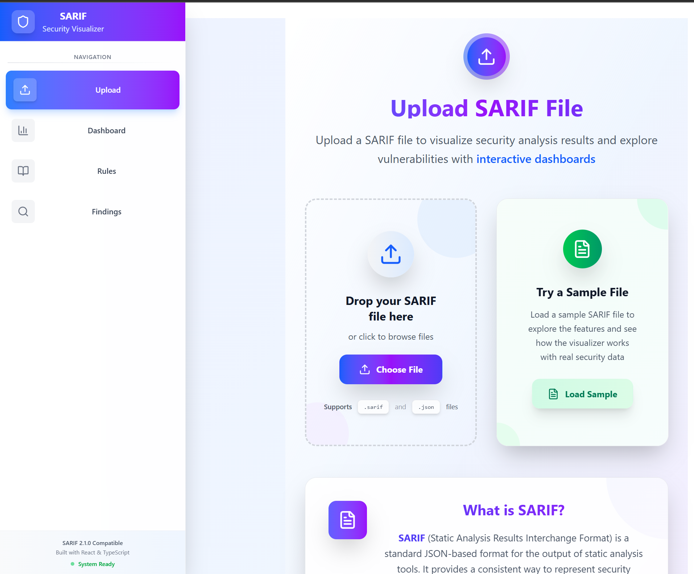
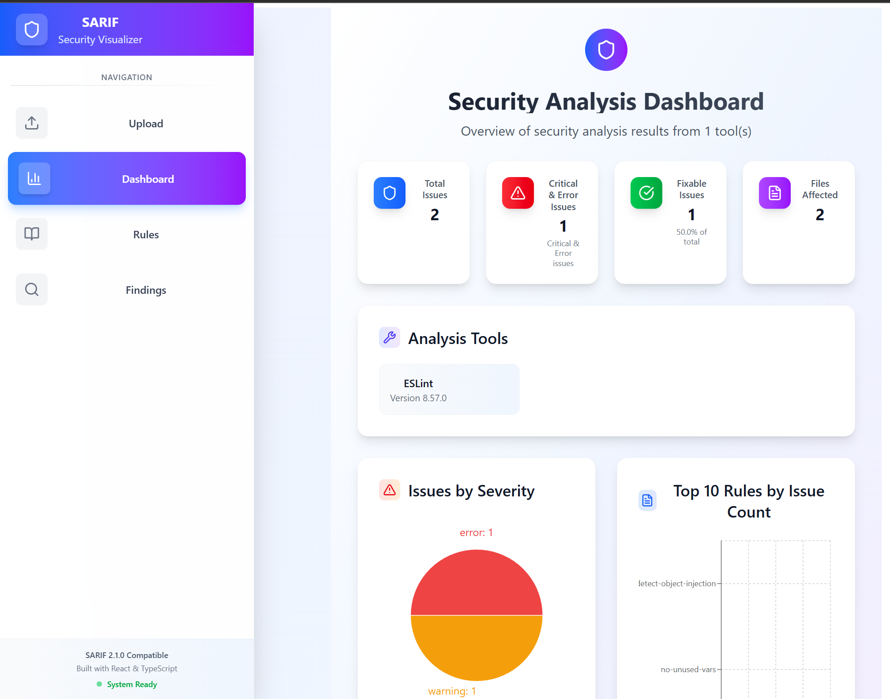
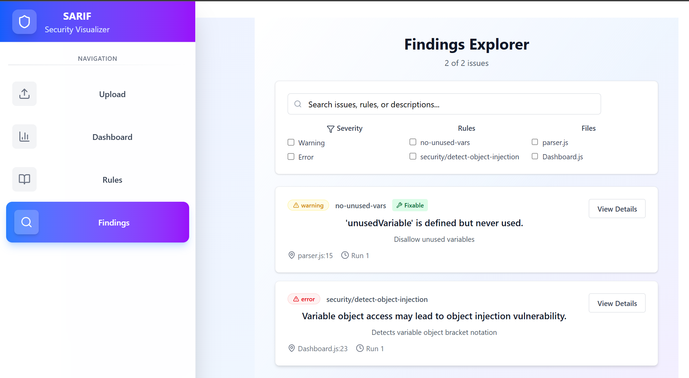
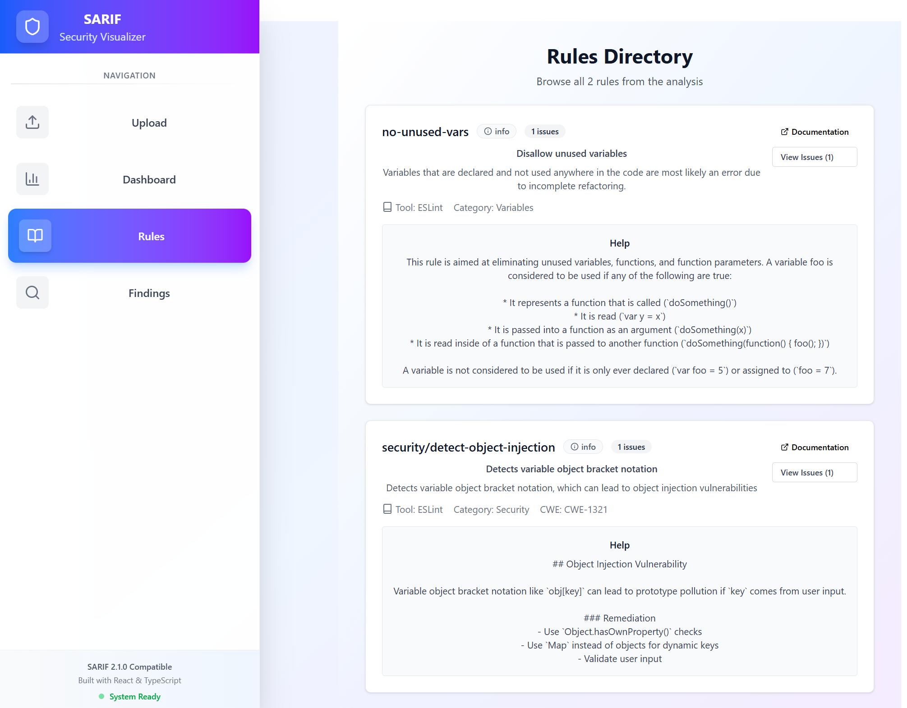

# Introducing SARIF Visualizer: Transform Your Security Scan Reports into Actionable Insights

*Published: October 26, 2025*

## The Challenge of Modern Security Analysis

In today's software development landscape, security scanning tools are essential. Whether you're using ESLint, Snyk, CodeQL, SonarQube, or Semgrep, these tools generate crucial security and code quality findings. But there's a problem: the output format.

Most security tools export their results in SARIF (Static Analysis Results Interchange Format) - a standardized JSON format that's great for machine processing but challenging for humans to digest. Opening a raw SARIF file in a text editor reveals thousands of lines of nested JSON that's nearly impossible to navigate efficiently.

**What if you could visualize all that data in seconds, without installing anything?**

## Meet SARIF Visualizer

SARIF Visualizer is a modern, responsive web application that transforms complex SARIF reports into beautiful, interactive dashboards. Built with React, TypeScript, and Tailwind CSS, it provides security teams, developers, and DevOps engineers with instant insights into their code quality and security posture.

  

**🔗 Try it now:** [Docker Hub](https://hub.docker.com/r/mykolaa25/sarifvisualizer) | [GitHub Repository](https://github.com/NickolaiA/SARIFVisualizer)

## Why SARIF Visualizer?

### 🚀 Zero Setup Required

Forget about Node.js, npm, webpack configs, or build processes. With our Docker image, you're up and running in under 60 seconds:

```bash
docker pull mykolaa25/sarifvisualizer:latest
docker run -d -p 99:80 --name sarifvisualizer mykolaa25/sarifvisualizer:latest
```

Open `http://localhost:99` and you're done. No compilation, no dependencies, no headaches.

### � Upload Page - Simple and Intuitive



The upload page greets you with a clean, modern interface. Simply drag and drop your SARIF file, or click to browse. The application also provides a sample file so you can explore features immediately without needing your own SARIF data.

### 📊 Rich Visual Dashboard



The moment you upload a SARIF file, you're greeted with a comprehensive dashboard featuring:

- **Summary Statistics**: Total issues, severity breakdown, and fixable issues at a glance
- **Severity Distribution**: Beautiful pie charts showing the proportion of errors, warnings, and notes
- **Rule Breakdown**: Bar charts identifying which rules trigger the most findings
- **File Impact Analysis**: Visualize which files have the most issues
- **Tool Information**: See which analysis tools were used and their versions

### 🔍 Advanced Filtering and Search



The Findings Explorer goes beyond simple lists:

- **Multi-dimensional Filters**: Filter by severity (error, warning, note, info), specific rules, or affected files
- **Real-time Search**: Search across issue messages instantly
- **Smart Sorting**: Sort by severity, rule ID, or file location
- **Quick Navigation**: Jump directly to detailed views with one click

### 📚 Comprehensive Rule Directory



Understanding the "why" behind findings is crucial:

- **Complete Rule Catalog**: Browse all rules with descriptions and metadata
- **External Documentation**: Direct links to official documentation for each rule
- **Usage Statistics**: See how many issues each rule has identified
- **Category Classification**: Rules organized by category and CWE classification

### 📄 Detailed Issue Analysis

*Note: Detailed issue view shows comprehensive information including code locations, descriptions, and vulnerability enrichment data.*

When you need to dig deep:

- **Complete Context**: Full issue descriptions with Markdown support
- **Code Locations**: Precise file paths, line numbers, and column positions
- **Snippet Preview**: See the problematic code in context
- **Related Locations**: Understand issue chains and related code sections
- **Fix Suggestions**: View automated fix suggestions when available
- **CVE/CWE Enrichment**: Automatic vulnerability database lookups for security issues

## Key Features That Set Us Apart

### 🔗 Vulnerability Enrichment

SARIF Visualizer automatically enriches security findings with information from CVE and CWE databases. When it detects a security vulnerability, it fetches:

- Detailed vulnerability descriptions
- Severity ratings and CVSS scores
- Remediation recommendations
- External references and resources

This transforms a simple "SQL Injection" finding into actionable intelligence with context and guidance.

### ⚡ Performance Optimized

Large SARIF files can contain thousands of findings. We use Web Workers to parse files in the background, ensuring the UI remains responsive even with massive reports. Upload a 50MB SARIF file, and you'll still get instant feedback.

### 📱 Fully Responsive

Whether you're reviewing findings on your development workstation, presenting results on a projector, or checking issues on a tablet during a meeting - SARIF Visualizer adapts perfectly to any screen size.

### 🎨 Modern, Intuitive UI

Built with Tailwind CSS, the interface is clean, modern, and easy to navigate. Color-coded severity badges, intuitive icons, and thoughtful spacing make information dense reports easy to digest.

### 🔒 Privacy First

SARIF Visualizer is completely client-side. Your SARIF files never leave your browser. Everything happens locally, so your sensitive security data remains private and secure.

## Supported Analysis Tools

SARIF Visualizer supports the [SARIF 2.1.0 specification](https://docs.oasis-open.org/sarif/sarif/v2.1.0/sarif-v2.1.0.html), making it compatible with a wide range of security and code quality tools:

| Category | Tools |
|----------|-------|
| **Static Analysis** | ESLint, TSLint, Pylint, RuboCop |
| **Security Scanners** | Snyk, CodeQL, Fortify, Checkmarx |
| **Code Quality** | SonarQube, SonarCloud, PMD |
| **Vulnerability Detection** | Semgrep, Bandit, Brakeman |
| **Container Security** | Trivy, Clair, Anchore |
| **Cloud Security** | Prowler, ScoutSuite, CloudSploit |

And many more! If a tool can export SARIF, SARIF Visualizer can visualize it.

## Real-World Use Cases

### Use Case 1: Security Team Dashboard

A security team receives SARIF reports from multiple scanning tools across different projects. Instead of manually parsing JSON files or dealing with tool-specific UIs, they:

1. Upload all SARIF files to SARIF Visualizer
2. Use the dashboard to identify critical issues across projects
3. Filter by specific vulnerability types (e.g., all SQL injections)
4. Export findings with enriched CVE/CWE data for incident reports

### Use Case 2: CI/CD Pipeline Integration

A DevOps engineer wants to review scan results before approving deployments:

1. CI/CD pipeline generates SARIF reports from security scans
2. Pipeline artifacts include the SARIF file
3. Engineer downloads the artifact and uploads to SARIF Visualizer
4. Quickly reviews the dashboard to make go/no-go decisions
5. Drills into specific high-severity findings when needed

### Use Case 3: Developer Code Review

A developer receives a PR review comment about potential security issues:

1. Runs the security scanner locally (e.g., `eslint --format sarif`)
2. Opens SARIF Visualizer running on `localhost:99`
3. Uploads the SARIF file
4. Identifies all issues in their changes
5. Uses the enrichment data to understand proper fixes
6. Validates fixes by re-running the scanner

## Getting Started in 3 Steps

### Step 1: Run SARIF Visualizer

**Option A: Docker (Recommended - 30 seconds)**

```bash
docker run -d -p 99:80 --name sarifvisualizer mykolaa25/sarifvisualizer:latest
```

**Option B: Docker Compose (Infrastructure)**

```yaml
version: '3.8'
services:
  sarifvisualizer:
    image: mykolaa25/sarifvisualizer:latest
    container_name: sarifvisualizer
    ports:
      - "99:80"
    restart: unless-stopped
```

Then: `docker-compose up -d`

**Option C: Build from Source (For Developers)**

```bash
git clone https://github.com/NickolaiA/SARIFVisualizer.git
cd SARIFVisualizer
npm install
npm run dev
```

### Step 2: Open Your Browser

Navigate to `http://localhost:99` (Docker) or `http://localhost:5173` (development)

### Step 3: Upload and Explore

Drag and drop your SARIF file, or use the file picker. That's it!

## Technical Architecture

For the technically curious, here's what powers SARIF Visualizer:

### Frontend Stack

- **React 19.2.0**: Latest React with concurrent features for optimal performance
- **TypeScript 5.9.3**: Full type safety across the entire codebase
- **Vite 7.1.11**: Lightning-fast builds and hot module replacement
- **Tailwind CSS 4.1.15**: Utility-first styling for rapid UI development
- **Zustand 5.0.8**: Lightweight state management (< 1KB)
- **React Router 7.9.4**: Declarative routing with nested routes
- **Recharts 3.3.0**: Beautiful, composable charts built on D3
- **React Markdown**: Rich text rendering for issue descriptions
- **DOMPurify**: XSS protection for user-generated content

### Performance Optimizations

- **Web Workers**: File parsing runs off the main thread
- **Code Splitting**: Lazy-loaded routes reduce initial bundle size
- **Memoization**: React.memo and useMemo prevent unnecessary re-renders
- **Virtual Scrolling**: Handle thousands of findings without lag

### Production Deployment

- **Multi-Stage Docker Build**: Node.js build stage → nginx production stage
- **Multi-Platform Support**: ARM64 and AMD64 images for universal compatibility
- **Optimized Bundle**: Tree-shaking and minification reduce bundle to ~730KB
- **Static Asset Serving**: nginx with gzip compression and caching headers
- **Health Checks**: Built-in Docker health monitoring

## Multi-Platform Support

SARIF Visualizer's Docker image is built for multiple architectures, ensuring it runs smoothly on:

- ✅ **Windows** (Intel/AMD processors)
- ✅ **macOS** (Intel Macs and Apple Silicon M1/M2/M3)
- ✅ **Linux** (x86_64 and ARM64)
- ✅ **Cloud Platforms** (AWS Graviton, Azure ARM, Google Cloud)
- ✅ **Edge Devices** (Raspberry Pi 4+, NVIDIA Jetson)

Docker automatically pulls the correct image for your platform. No configuration needed.

## Open Source and Community

SARIF Visualizer is open source under the MIT License, welcoming contributions from the community.

### Contributing

We'd love your help! Whether it's:

- 🐛 Bug reports and fixes
- ✨ New feature suggestions
- 📝 Documentation improvements
- 🌍 Translations and internationalization
- 🎨 UI/UX enhancements

Check out our [GitHub repository](https://github.com/NickolaiA/SARIFVisualizer) and open an issue or pull request.

### Roadmap

Here's what's coming next:

- **SARIF Report Comparison**: Compare two SARIF files to see what changed
- **Export Features**: Export filtered results as CSV, PDF, or new SARIF
- **Team Collaboration**: Share findings with annotations and comments
- **Trend Analysis**: Track issue counts over time across multiple scans
- **Custom Themes**: Dark mode and customizable color schemes
- **Batch Processing**: Upload multiple SARIF files and view aggregated results
- **API Integration**: REST API for programmatic access
- **Browser Extensions**: Upload SARIF files directly from GitHub/GitLab

## Frequently Asked Questions

### Q: Is my SARIF data sent to a server?

**A:** No. SARIF Visualizer is completely client-side. All processing happens in your browser. Your security data never leaves your machine.

### Q: What's the file size limit?

**A:** There's no hard limit, but very large files (>100MB) may take longer to parse. We use Web Workers to keep the UI responsive during parsing.

### Q: Can I use this in my CI/CD pipeline?

**A:** Yes! Run SARIF Visualizer as a Docker container in your pipeline, or generate HTML reports programmatically. We're working on a headless mode specifically for CI/CD.

### Q: Does it work offline?

**A:** The Docker image includes everything needed to run offline. The only external calls are for CVE/CWE enrichment, which gracefully degrades if offline.

### Q: Can I customize the look and feel?

**A:** Currently, the theme is fixed. Dark mode and custom themes are on our roadmap. The source code is available if you want to build a custom version.

### Q: What browsers are supported?

**A:** All modern browsers: Chrome, Firefox, Edge, Safari. We test on the latest two versions of each.

## Pricing

SARIF Visualizer is **100% free and open source**. 

No subscriptions, no trials, no feature gates. Use it in personal projects, commercial products, or enterprise environments.

If you find it valuable, consider:
- ⭐ Starring the [GitHub repository](https://github.com/NickolaiA/SARIFVisualizer)
- ☕ [Buying me a coffee](https://buymeacoffee.com/nick_a)
- 📢 Sharing with your team and network

## Get Started Today

Transform your SARIF reports from cryptic JSON files into actionable security insights.

**🚀 Quick Start:**
```bash
docker pull mykolaa25/sarifvisualizer:latest
docker run -d -p 99:80 --name sarifvisualizer mykolaa25/sarifvisualizer:latest
```

**📦 Docker Hub:** [https://hub.docker.com/r/mykolaa25/sarifvisualizer](https://hub.docker.com/r/mykolaa25/sarifvisualizer)

**💻 GitHub:** [https://github.com/NickolaiA/SARIFVisualizer](https://github.com/NickolaiA/SARIFVisualizer)

**☕ Support:** [https://buymeacoffee.com/nick_a](https://buymeacoffee.com/nick_a)

---

## About the Author

SARIF Visualizer is built and maintained by [Mykoal A.](https://github.com/NickolaiA), a software architect with nearly 30 years of experience, passionate about developer tools, security, and open source.

**Connect:**
- GitHub: [@NickolaiA](https://github.com/NickolaiA)
- Docker Hub: [mykolaa25](https://hub.docker.com/u/mykolaa25)

---

## Screenshots Gallery

### Upload Page - Get Started Instantly

*Clean, modern upload interface with drag-and-drop support. Try the sample file feature to explore the visualizer with real security data immediately.*

### Dashboard - Overview and Statistics

*The main dashboard provides instant insights into your SARIF report with interactive charts, summary statistics, and tool information. See total issues, severity breakdown, and identify top problematic rules at a glance.*

### Rules Directory - Complete Rule Catalog

*Browse all analysis rules with comprehensive descriptions, help documentation, and usage statistics. Each rule shows the tool that generated it, category classification, CWE references, and links to external documentation.*

### Findings Explorer - Filter and Search

*Advanced filtering capabilities help you find exactly what you're looking for among thousands of findings. Filter by severity, specific rules, or affected files. Real-time search across issue descriptions. Each finding shows its severity, fixability status, file location, and quick access to detailed views.*

---

*Made with ❤️ for the security and development community*

**Tags:** #SARIF #Security #DevSecOps #StaticAnalysis #CodeQuality #Docker #React #TypeScript #OpenSource #SecurityTools #Visualization
